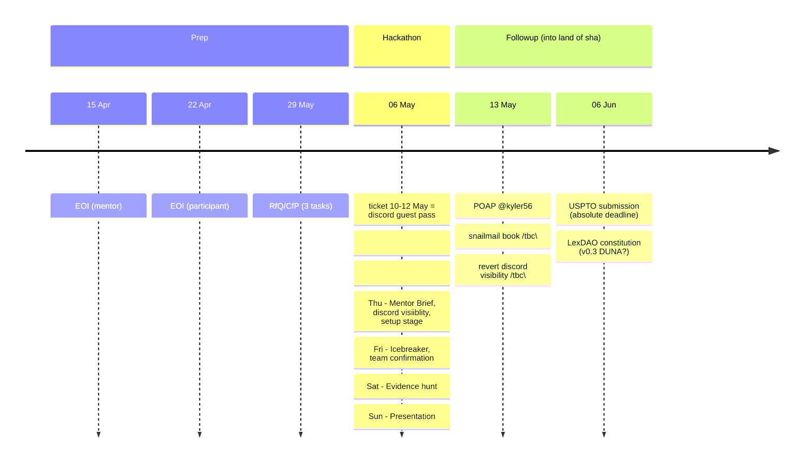
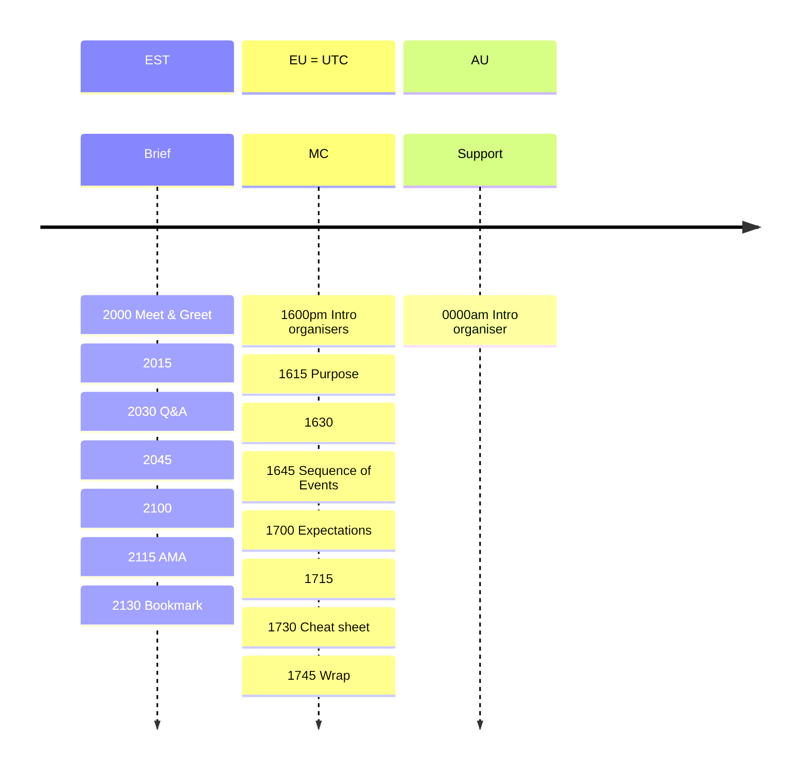
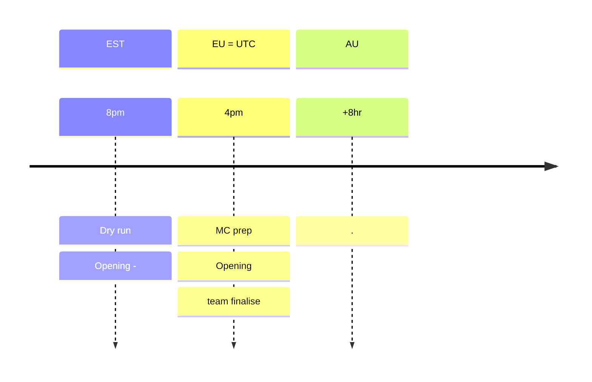
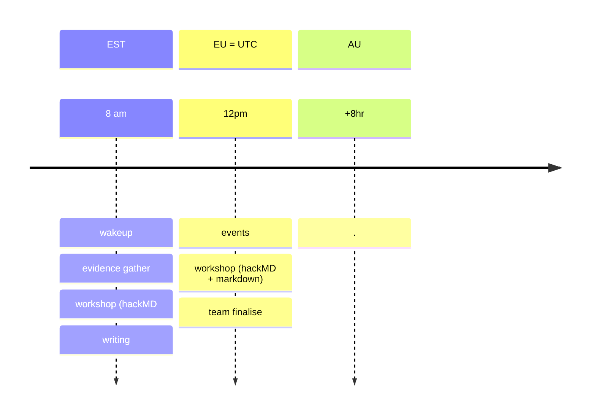
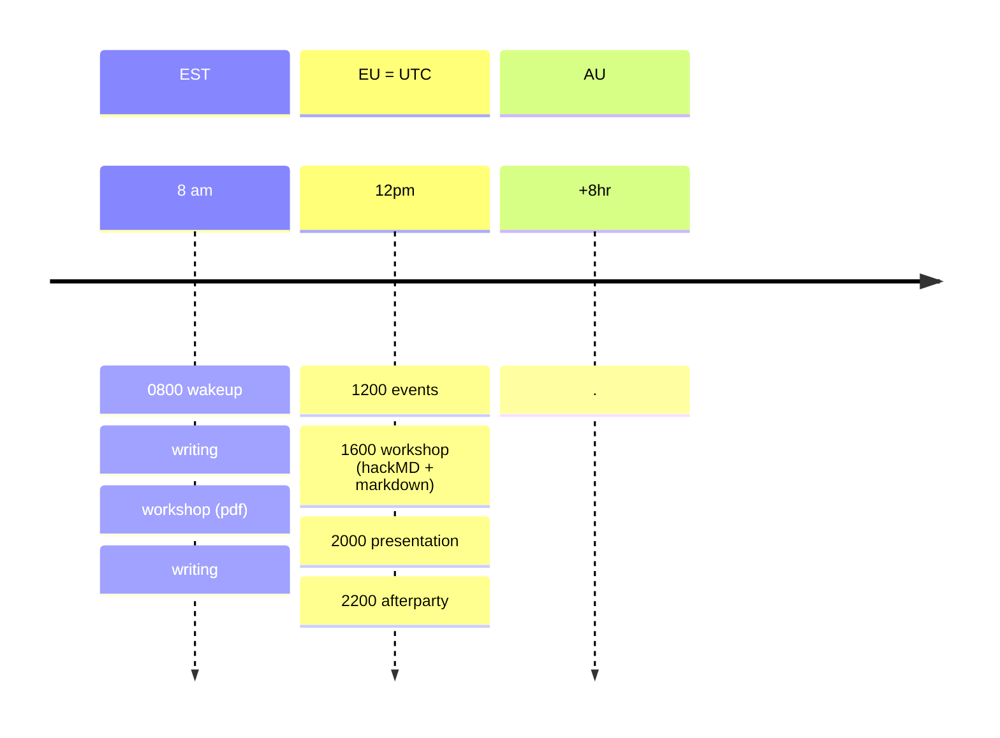

# Hackªtho®n Runsheet

## Raid target

"Uncle~~ar~~" Sam PiTO (USPTO) in the land of sha🅓🅞🅦 is holding up our guildname ||[wordmark](https://tsdr.uspto.gov/#caseNumber=97828729&caseSearchType=US_APPLICATION&caseType=DEFAULT&searchType=statusSearch) registration & issuance|| of 𝐿𝑒𝑥𝐷𝐴𝑂. A squab of seasoned professionals have cast a spell for l'externs to time-travel and retrieve precious specimens to prove the falsity of such injust charges.

Registration .. refused because ... <i>merely describes a feature of applicant’s services</i> but <b>you</b>  (~3.5 squabs) will argue that ...
5 arms of rebuttat in administrative ruling of Trademark Act Section 2(e)(1), 15 U.S.C. §1052(e)(1); see TMEP §§1209.01(b), 1209.03 et seq
  

- ~~expert opinion provided as reference draft~~
- Le⚔DAO is [suggestive](https://i0.wp.com/lexdao.org/wp-content/uploads/2023/04/Andres__-_StinkyPinky_fully_armored_medieval_knights_debating_i_f2f87665-092c-470f-9060-c8f2d4ebbd51.webp?w=1024&ssl=1)
- LexDA☯️ is [symbolic](https://substackcdn.com/image/fetch/w_848,h_565,c_fill,f_webp,q_auto:good,fl_progressive:steep,g_center/https%3A%2F%2Fsubstack-post-media.s3.amazonaws.com%2Fpublic%2Fimages%2F06cb6353-9738-42f9-bbeb-4722f8f04e0f_1024x1024.jpeg) || for squab of legal engineers ||
- `LexDAO` on polciy grounds less [inconsistent]() with TRIPs obligations under collective marks 

✋ concurrent use of LexDAO as collective identity

 retained for full-members only

## RunSheet of Events
Additional events for guests [^1]

### Thu - Mentor Briefing

### Fri - team formation + ice-breaker

### Sat - evidence gathering

### Sun - compilation+presentation of submission

---
Additional events /tbc\
| Who | What | When |
|-----|-----|-----|
| @bestape | CfP JOLE | 15min |
| Kyer56 | BoF CodeX ML workshop | 4x15 ? |
| DUNA | video replay | 4x15min |
| DUNA ¿espanol? | interpreation | 4x15min 
| space DUNA | ??? | WorldCafe |
| ??? | gist-Walchit | 15 min + video |
| @soursummer7 | gist-Szaboan | 15 min + video |
| @soursummer7 | gist-Zamfir  | 15 min + video |
| ??? | gist-Woodoo  | 15 min + video |
| @lawpanda+Christian?+1  | fishbowl | 3x15min + 15 |
[^1]: 

BoF = [Birds of a Feather](https://en.wiktionary.org/wiki/birds-of-a-feather_session)
[Fishbowl](https://en.wikipedia.org/wiki/Fishbowl_(conversation)) = 3/5 (_open_-~~capped-closed~~
LightningTalk - current projects eg Ignite format
WorldCafe
PechaKucha